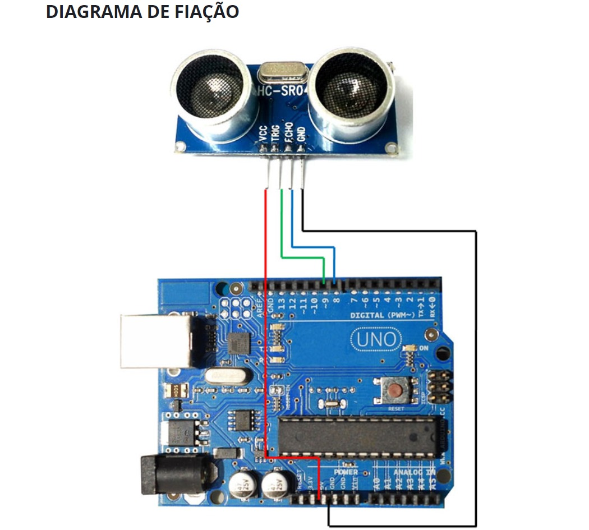
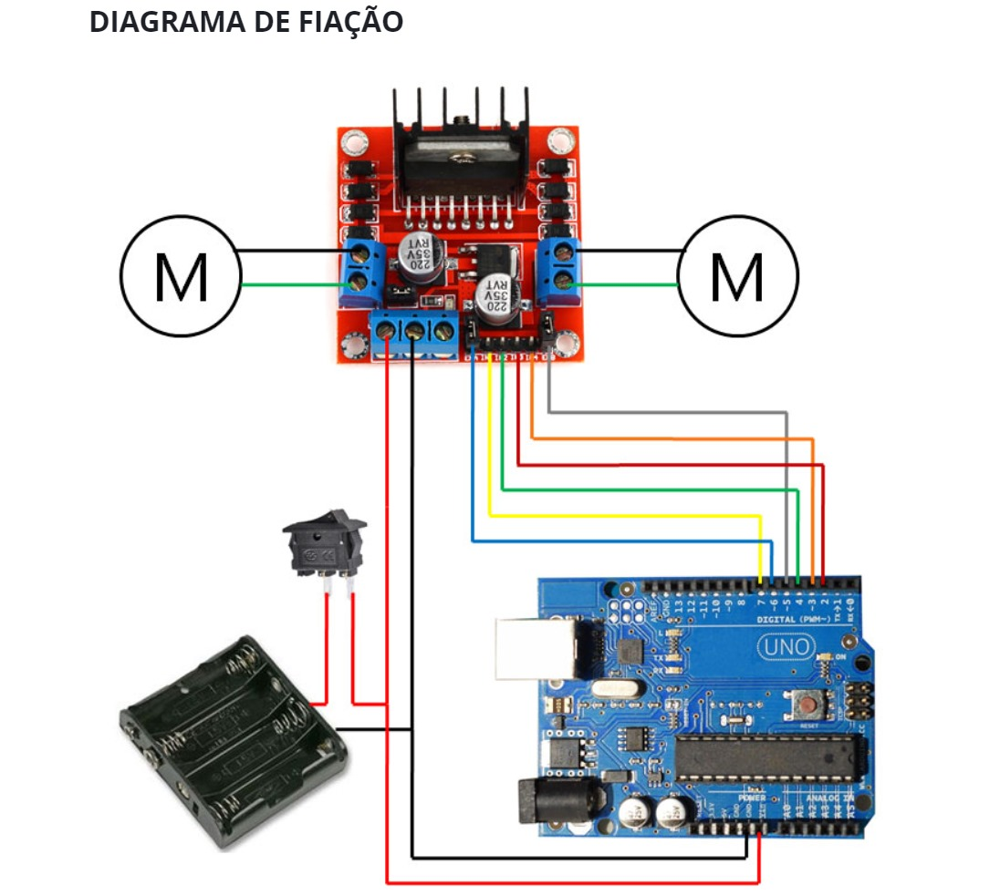

# Passo a passo

### 1

- Conectar o sensor de presença no arduino

  

### 2

- Conectar o controlador dos motores

  **OBS:** pode ser necessário remover a proteção dos pinos laterais (cinza e azul)
  
